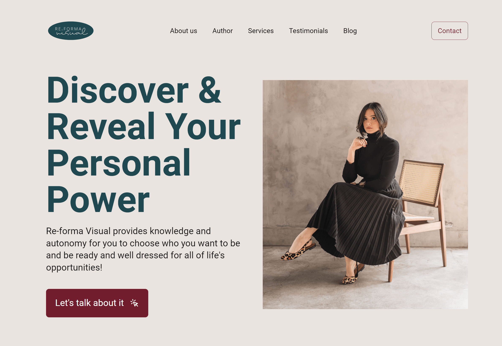
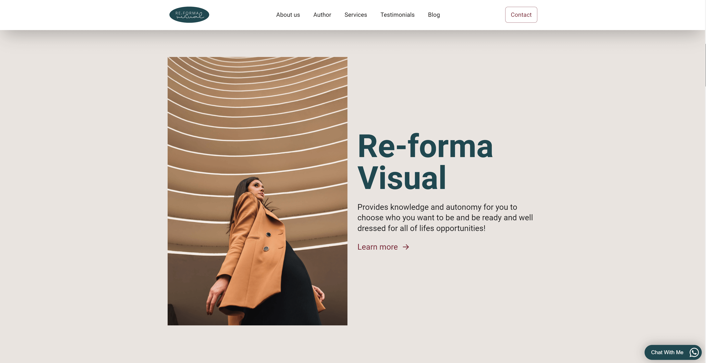
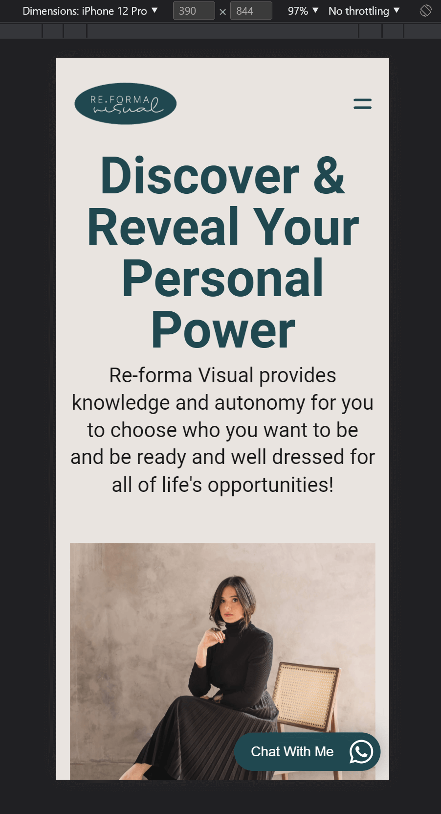
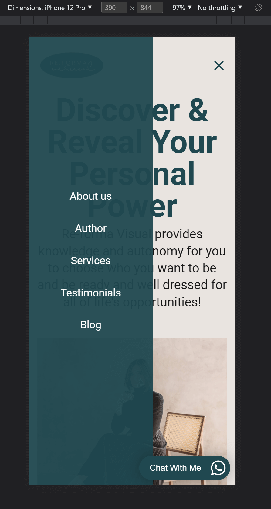

<div  align="center">


</div>


<h1  align="center">

🖥 Re-Forma Visual - Landing Page 📱

</h1>

<div  align="center">


</div>


## 🗃 Project

Objective: Renew the website with the most modern technology in order to improve performance and user experience on any device/platform.

</br>


## 🛠 Technologies

This project was developed with the following technologies:

   **JavaScript**

   **TypeScript**

   **React**

   **TailwindCSS**

</br>

## 📕 Libraries


This project used the following libraries:

- [Animate on scroll](https://github.com/michalsnik/aos)

- [Swiper](https://swiperjs.com/)

</br>


## 💻 Demonstration


<h5 align="center"> 🔗 Online: https://react-reforma-visual.vercel.app</h5>

</br>
<p  align="center">
  <h5 align="center">🖥 Desktop:</h5>
  <kbd>

</kbd>
  <kbd>

</kbd>
</p>
  <h5 align="center">📱 Mobile:</h5>
<p  align="center">
<kbd>

</kbd>
<kbd>

</kbd>
</p>

</br>

## 🚀 How to run

If you want to run the project on your local machine, just follow the steps below:

```bash
$ git clone https://github.com/guilhermemm-dev/react-reforma-visual

# Install the dependencies

$ yarn install or npm install

# Run

$ yarn run dev or npm run dev

```


</br>

## 📝 License


This project is licensed under the MIT license.


</p>


</br>
<hr/>
</br>


<h3> Guilherme Martins - @guilhermemm-dev </h3>

- Portfolio: https://guilhermemm.dev

- LinkedIn: https://www.linkedin.com/in/guilhermemm-dev

- GitHub: https://github.com/guilhermemm-dev

- Email: guilhermemm.dev@gmail.com
